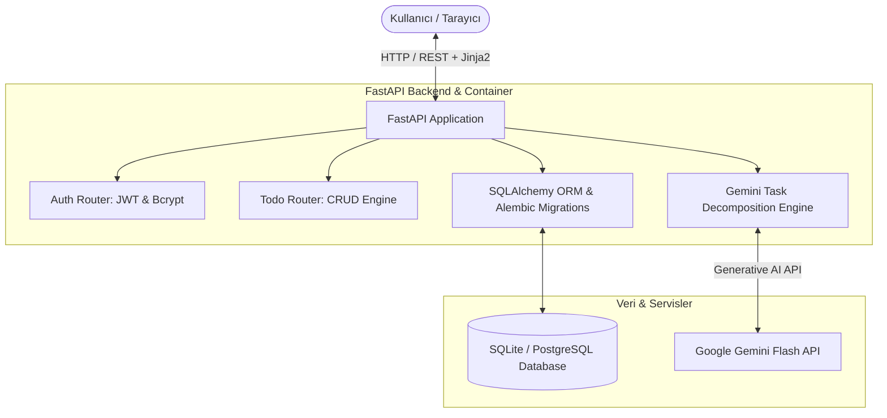

<div align="center">

# 📋 ToDoGemini — AI Destekli Görev Ayrıştırma & Dağıtık Backend Servisi

[](https://fastapi.tiangolo.com)
[](https://www.docker.com)
[](https://aistudio.google.com)
[](https://www.sqlalchemy.org)
[](LICENSE)

<p align="center">
  <strong>Basit görevleri Gemini AI ile eyleme geçirilebilir alt adımlara, akıllı önceliklere ve sprint planlarına dönüştüren modern görev yönetim platformu.</strong>
</p>

[Özellikler](#-özellikler) • [Mimari Şeması](#%EF%B8%8F-sistem-mimarisi) • [Docker ile Hızlı Başlangıç](#-docker-ile-h%C4%B1zl%C4%B1-ba%C5%9Flang%C4%B1%C3%A7) • [Geliştirici](#-geli%C5%9Ftirici)

---

</div>

## 🎯 Problem & Vizyon

İnsanların hedeflerine ulaşamamasının en temel sebebi, büyük görevlerin ("Projeyi Bitir", "Mülakata Hazırlan", "Sınava Çalış") somut ve yönetilebilir alt adımlara bölünmemesidir.

**ToDoGemini**, tek bir görev başlığından yola çıkarak arka planda Google Gemini API ile:
1. Görevin zorluğunu ve amacını analiz eder,
2. Gerçekçi, sıralı ve ölçülebilir 3-5 adet alt görev (subtask) üretir,
3. Doğru öncelik seviyesini (Low / Medium / High / Critical) belirler,
4. Kullanıcıya motivasyonel akıllı bir yan panel asistanı sunar.

---

## 🏗️ Sistem Mimarisi



---

## ✨ Temel Özellikler

| Modül | Yetenek | Açıklama |
| :--- | :--- | :--- |
| 🧠 **AI Task Breakdown** | Otomatik Alt Görevler | Girilen görevi analiz edip 3-5 mantıksal alt adıma böler |
| ⚡ **Akıllı Önceliklendirme** | Dinamik Öncelik | Görevin aciliyetine ve içeriğine göre akıllı etiketleme |
| 🤖 **AI Kenar Çubuğu** | Kişisel Asistan | Görevleriniz hakkında soru sorabileceğiniz interaktif AI asistanı |
| 🔐 **Kullanıcı Doğrulama** | JWT & Password Hash | Güvenli kayıt, giriş ve kullanıcıya özel izole görev havuzu |
| 🐳 **Dockerized Deployment** | Tek Komutla Çalışma | `docker compose up` ile sıfır konfigürasyonla çalışır |
| 🔄 **Alembic Veritabanı** | Şema Göçleri | Veritabanı modellerinde kesintisiz versiyon kontrolü |

---

## 🚀 Docker ile Hızlı Başlangıç

### Ön Koşullar
* [Docker Desktop](https://www.docker.com/) & Docker Compose
* [Google Gemini API Key](https://aistudio.google.com/app/apikey)

### 1. Tek Komutla Çalıştırma (Önerilen)
```bash
# 1. Depoyu klonlayın
git clone https://github.com/mehmeteminakkaya/ToDo-List.git
cd ToDo-List

# 2. Ortam değişkenlerini oluşturun
cp .env.example .env
# .env dosyasına GOOGLE_API_KEY bilginizi girin

# 3. Docker ile ayağa kaldırın
docker compose up --build
```
Uygulama anında **`http://localhost:80`** (veya `http://localhost:8000`) adresinde hazır olacaktır.

---

## 💻 Yerel Python ile Geliştirme

Docker olmadan doğrudan çalıştırmak isterseniz:

```bash
# 1. Sanal ortam oluşturun ve aktif edin
python -m venv .venv
.venv\Scripts\activate   # Windows (.venv/bin/activate on Mac/Linux)

# 2. Bağımlılıkları yükleyin
pip install -r requirements.txt

# 3. FastAPI sunucusunu başlatın
uvicorn main:app --reload --port 8000
```

Swagger API dökümantasyonuna **`http://localhost:8000/docs`** adresinden erişebilirsiniz.

---

## 🛠️ Teknoloji Yığını

* **Backend:** FastAPI (Python 3.12), Pydantic v2, Passlib, Python-JOSE
* **Veritabanı & ORM:** SQLAlchemy, Alembic, SQLite / PostgreSQL
* **Yapay Zekâ:** Google Gemini Flash (`google-generativeai`)
* **Frontend:** Jinja2 HTML5 Templates, Vanilla CSS3, JavaScript
* **DevOps:** Docker Multi-stage Build, Docker Compose

---

## 👨‍💻 Geliştirici & İletişim

**Mehmet Emin Akkaya**  
*İstinye Üniversitesi Bilgisayar Mühendisliği*

* 🌐 **Portfolyo:** [mehmeteminakkaya.com](https://mehmeteminakkaya.com)
* 💼 **LinkedIn:** [linkedin.com/in/mehmeteminakkaya](https://www.linkedin.com/in/mehmeteminakkaya/)
* 🐙 **GitHub:** [@mehmeteminakkaya](https://github.com/mehmeteminakkaya)
* 📬 **E-Posta:** [aktaha@gmail.com](mailto:aktaha@gmail.com)

---

<div align="center">
  <sub>Telif Hakkı © 2026 Mehmet Emin Akkaya. Tüm hakları saklıdır.</sub>
</div>
